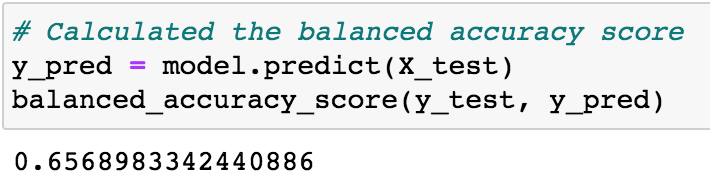
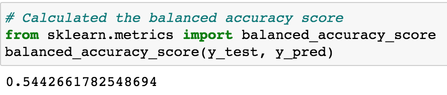
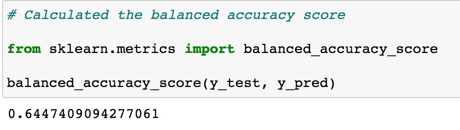
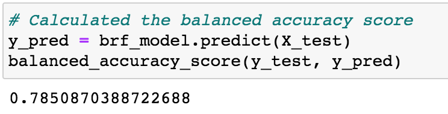
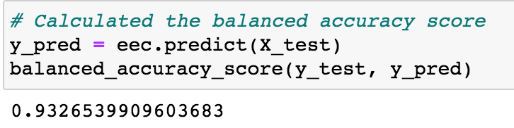

# Credit_Risk_Analysis

## Overview of Project:

For this project, use Python to build and evaluate several machine learning models to accurately predict credit risk. Using credit card data from LendingClub, evaluate the performance of 6 models: random over sampler, undersampling, SMOTE, SMOTEENN, Random Forest Classifier, and Easy Ensemble AdaBoost Classifier.

## Results: 
Using bulleted lists, describe the balanced accuracy scores and the precision and recall scores of all six machine learning models. Use screenshots of your outputs to support your results.

* Random Over Sampler

  * Accuracy Score

* SMOTE

  * Accuracy Score

The Random Over Sampler model will generate new samples by randomly selecting replacements from existing samples to account for the lack of minority representation. In this model, the accuracy score was 0.65 while the f1 score was 0.73. Using Synthetic Minority Over-sampling Technique or SMOTE, random sample points from the minority class are chosen then data points of the nearest neighbors are selected to generate synthetic examples. In this analysis, the SMOTE method produced a Balanced accuracy score of 0.66 and f1 of 0.80.

* Undersampling

  * Accuracy Score

Cluster Centroids is an undersampling method where the algorithm identifies clusters of the majority class, then generates synthetic data points called centroids. The majority class is then undersampled down to the size of the minority class. In this analysis, the Cluster Centroids method produced an accuracy score of 0.54 and an f1 of 0.56, which underperforms compared to the oversampling techniques with this particular dataset.

* SMOTEENN

  * Accuracy Score

The SMOTEENN method is a combination of oversampling and undersampling approaches, using SMOTE and Edited Nearest Neighbors (ENN). In this analysis, SMOTEENN produced an accuracy Score of 0.64 and an F-1 of 0.72, performing similarly to the Oversampling methods, but with a slightly lower recall score.

* Balanced Forest Classifier

  * Accuracy Score

* Easy Ensemble AdaBoost Classifier

  * Accuracy Score

The Balanced Random Forest Classifier method randomly under-samples each bootstrap sample to balance it. The Easy Ensemble Classifier also achieves balance through random undersampling, but by utilizing AdaBoost learners. In this analysis, the Balanced Random Forest Classifier had an accuracy score of 0.79 and an F-1 of 0.93, while Easy Ensemble Classifier had an accuracy score of 0.93 and an F-1 score of 0.97.

## Summary

Overall, the oversampling, undersampling, and combination sampling methods demonstrated high precision with a lower recall, so I would not recommend these models to predict credit risk in credit card applicants. On the other hand, the ensemble methods performed well with the Easy Ensemble Classifier performing best for its precision, recall, and F-1 score. I would recommend this method out of six methods explored in this analysis but would be cautious of overfitting. 
