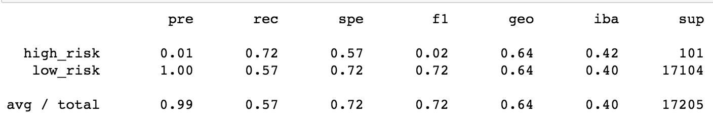

# Credit_Risk_Analysis

## Overview of Project:

For this project, use Python to build and evaluate several machine learning models to accurately predict credit risk. Using credit card data from LendingClub, evaluate the performance of 6 models: random over sampler, undersampling, SMOTE, SMOTEENN, Random Forest Classifier, and Easy Ensemble AdaBoost Classifier.

## Results: 
Using bulleted lists, describe the balanced accuracy scores and the precision and recall scores of all six machine learning models. Use screenshots of your outputs to support your results.

* Random Over Sampler

* SMOTE

The Random Over Sampler model will generate new samples by randomly selecting replacements from existing samples to account for minority representation. In this example the  accuracy score was 0.65 while the f1 score was 0.81. Using SMOTE (Synthetic Minority Over-sampling Technique), random examples from the minority class are chosen then k of the nearest neighbors are found. Neighbors are then used to generate synthetic examples. In this analysis, the SMOTE method produced a Balanced accuracy score of 0.62 and f1 of 0.77.

* Undersampling

* SMOTEENN

* Balanced Forest Classifier

* Easy Ensemble AdaBoost Classifier

Summary: Summarize the results of the machine learning models, and include a recommendation on the model to use, if any. If you do not recommend any of the models, justify your reasoning.
