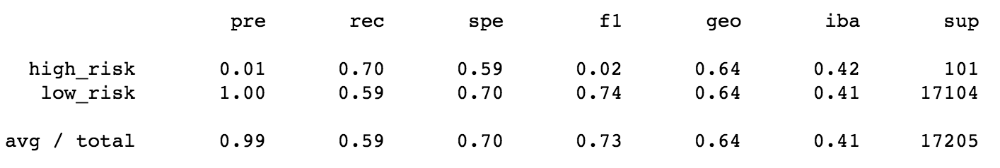
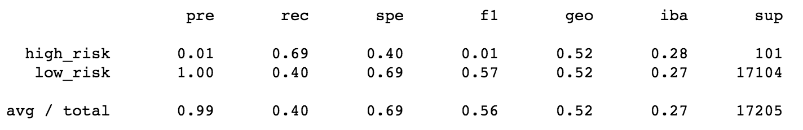
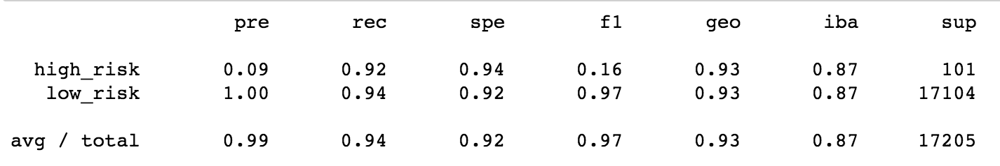

# Credit_Risk_Analysis

## Overview of Project:

For this project, use Python to build and evaluate several machine learning models to accurately predict credit risk. Using credit card data from LendingClub, evaluate the performance of 6 models: oversampling, undersampling, SMOTE, SMOTEENN, Random Forest Classifier, and Easy Ensemble AdaBoost Classifier.

## Results: 
Using bulleted lists, describe the balanced accuracy scores and the precision and recall scores of all six machine learning models. Use screenshots of your outputs to support your results.

* Oversampling

* Undersampling

* SMOTE

* SMOTEENN

* Balanced Forest Classifier

* Easy Ensemble AdaBoost Classifier

Summary: Summarize the results of the machine learning models, and include a recommendation on the model to use, if any. If you do not recommend any of the models, justify your reasoning.
